Rewrite the NeRF code with some slight modifications.

1. Different datasets have different definitions of the transformation matrix from the meshgrid (used in get_rays function for ray generation) to the camera coordinates. In this code, the transformation matrix should be explicitly defined as mg2c. (e.g., in lego dataset, the camera coord is right-up-backward, while the meshgrid coord is right-down-forward. Thus, a mg2c of (1,-1,-1) should be defined in the train_lego.py. Similar to replica dataset with (1,1,1).)

2. There are two ways to define the camera intrinsics: 1) just an isotropic focal length with no origin translation; 2) a 3x3 intrinsics matrix containing params $f_x$, $f_y$, $c_x$, $c_y$. The get_ray function is modified to be able to handle both of these two params f or K. Besides, I think use torch.matmul() is more intuitive than the way the nerf used for coordinate transformation:(.

3. (For author himself :) Please see the comments about coordinate transformation in data_processor.py. 

I refer to the [NeRF](https://github.com/bmild/nerf) and [DM-NeRF](https://github.com/vLAR-group/DM-NeRF) for code rewriting. the datasets I test the code are [lego](https://drive.google.com/drive/folders/128yBriW1IG_3NJ5Rp7APSTZsJqdJdfc1) (synthetic data) and [replica](https://github.com/Harry-Zhi/semantic_nerf). 

21 Mar 2023 v1.1

Add tools for coordinate transformations (see ./tools) based on [here](http://ksimek.github.io/2012/08/22/extrinsic/).
The mg2c in the last version is integrated into the process of intrinsics generation. It's actually the coordinate transformation from image/camera coordinates with different definitions (e.g., opencv, opengl or others) to the pixel plane.

23 Mar 2023 v1.1

- Add visualizer for generating pointcloud and mesh of the object by the perdicted depth+rgb map.
- Test the coordinate transformation tool. It works correctly now.
- Train the network with blender datset (lego and hotdot). The results on 3 metrics (PSNR, SSIM and LPIPS) are all similar to that in the paper.
- Adjust the code structre with higher readibility.
- Add render_pose generation tool for algo. test. Now it can only provide circle-around path and marching-like path, both of which looking at the target.

24 Mar 2023 v1.1
- The evaluation metrics compared with that in the paper
    | dataset_code_iters  | PSNR  | SSIM   | LPIPS  |
    |---|---|---|---|
    | synthetic_lego_haru_200K (resize:50%)  |  30.43 |0.957 |0.039 |
    | synthetic_lego_nerf_500K  |  32.54 |0.961 |0.050 |
    | synthetic_hotdog_haru_200K (full size)  |  34.82 |0.966 |0.048 |
    | synthetic_hotdog_nerf_500K  |  36.18 |0.974 | 0.121 |
    ||||

- Visualization about the syhthetic views:
    
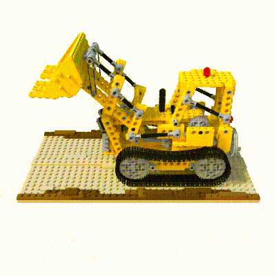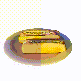

    
- [Pointcloud](https://youtu.be/Vi1iftw7FQQ), [voxel](https://youtu.be/irh28e_FcYI) and [mesh](https://youtu.be/D5L9xWYBkY8) of the lego dataset

25 Mar 2023 v1.1
- The camera coordinate type should be **explicitly claimed** like 'opencv' or 'opengl' when using all the functions in coord_trans_np.py to avoid coordinate inconsistency.
- Testing the network on Replica dataset room_1. The depth and rgb imgs are obtained from [Semantic-NeRF](https://github.com/Harry-Zhi/semantic_nerf)

    | dataset_code_iters  | PSNR  | SSIM   | LPIPS  |
    |---|---|---|---|
    | replica_room1_haru_200K  |  32.87 |0.899 |0.173 |
    | replica_room1_[DM-Nerf](https://github.com/vLAR-group/DM-NeRF)_500K  |  34.72 |0.931 | 0.134 |
    ||||

*the following visualization is implemented with resize factor=0.5. But there is **no resize operation** when training.
- Visualization about the synthetic views:
    
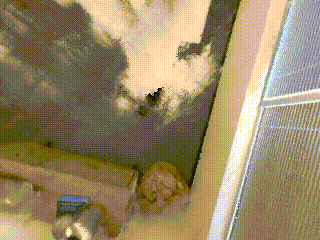

    *Note that this path will be optimized after. Now it's just a combination of several marching pathes looking at a fix point.*

- Ground-Truth and predicted pointcloud of dataset Replica_room1:
    
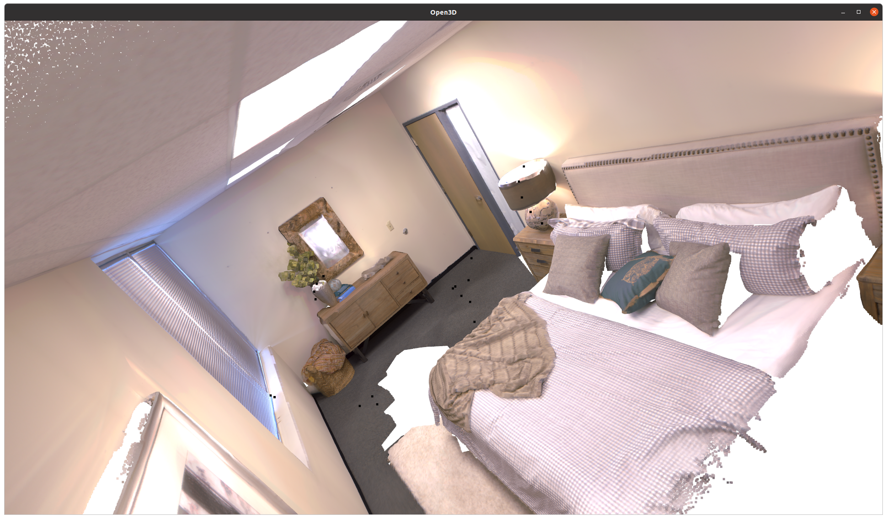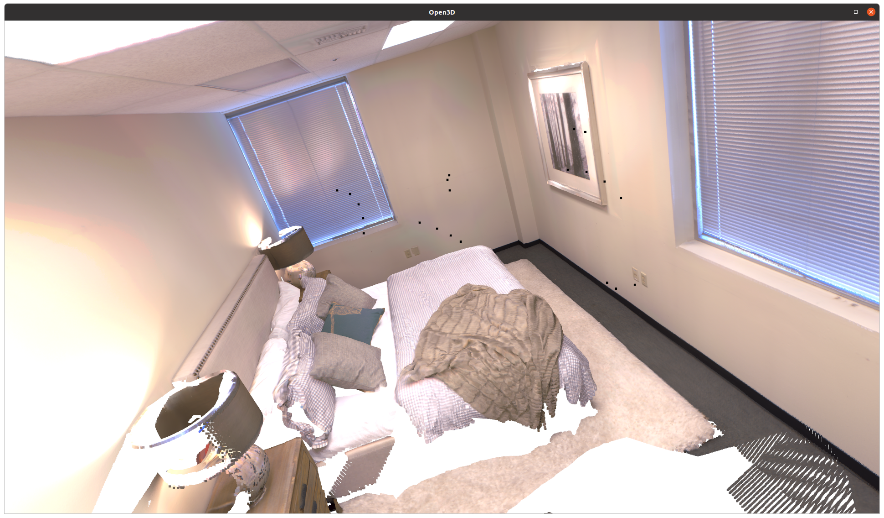

    
Ground Truth Pointcloud

    
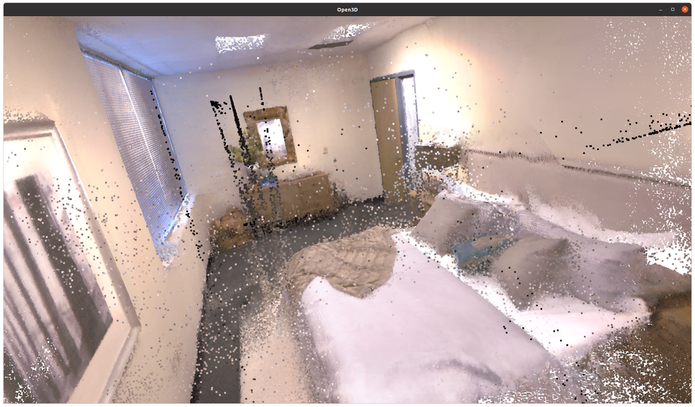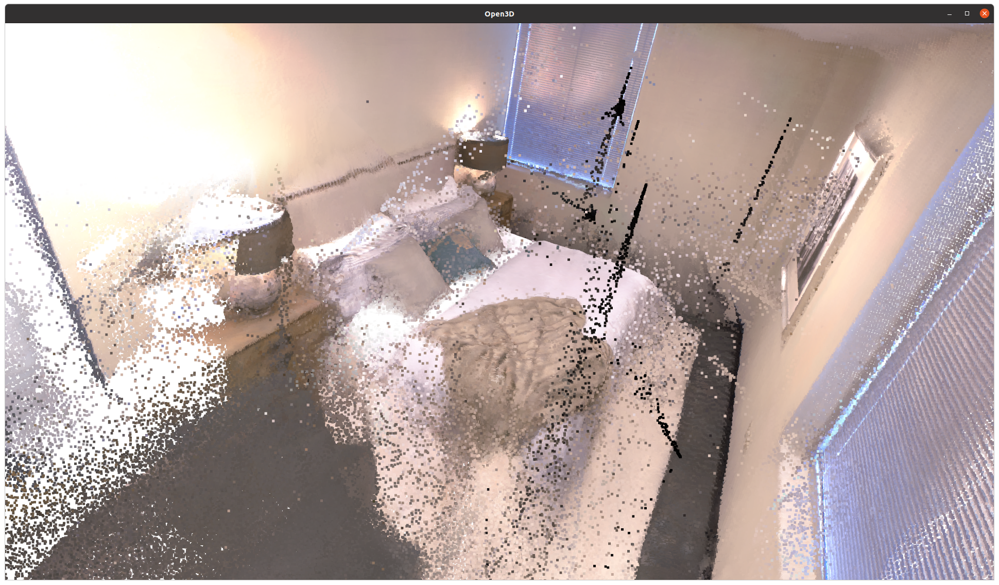

    
Predicted Pointcloud

    
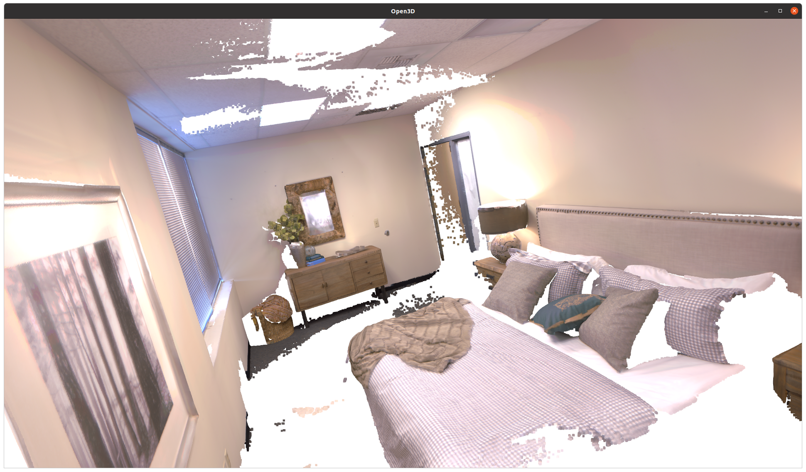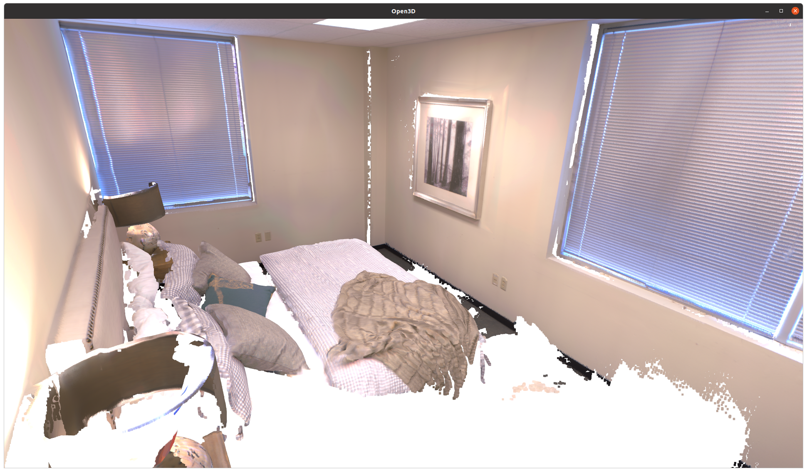

    
Ground Truth Voxel

    
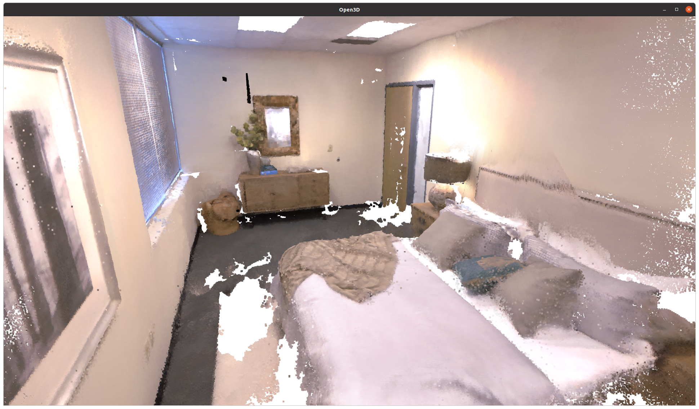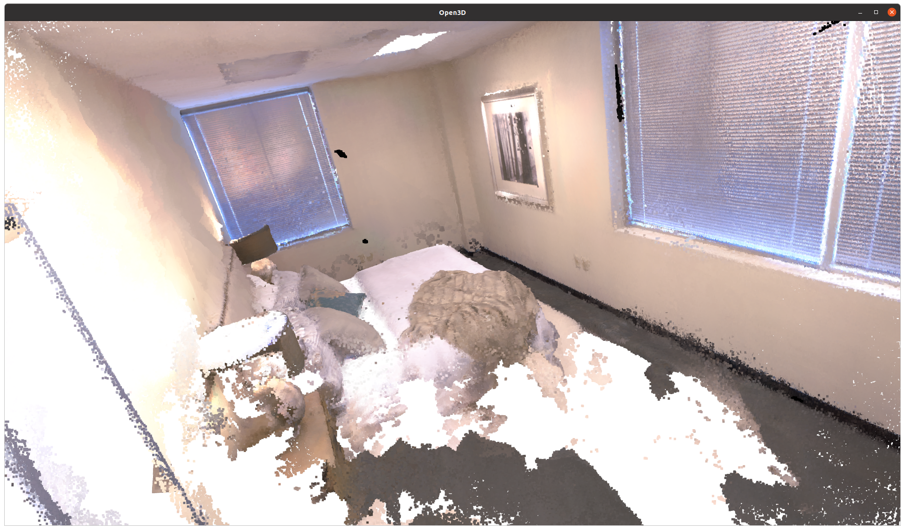

    
Predicted Voxel (after outlier removal)

    
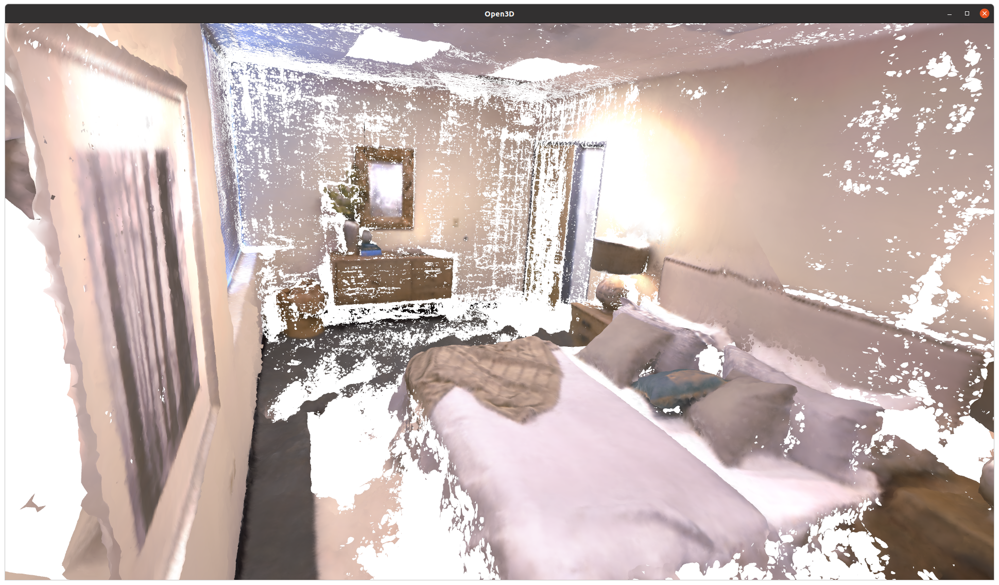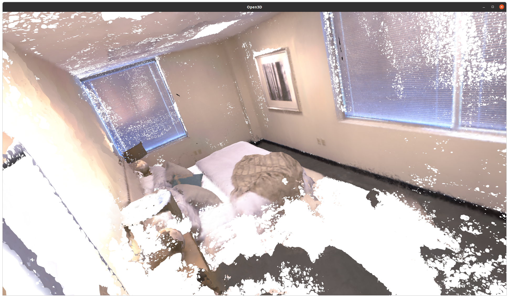

    
Predicted Mesh

    

